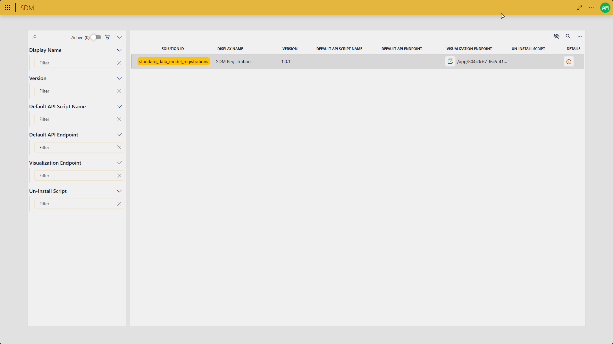

# Solution Registration

This solution serves as a central registry for that information. It comes with:

- A C# library for registering your DataMiner solution and its data types during installation
- A Low-Code app for browsing and reviewing all registered solutions and their data types for a given DataMiner system

## Use Cases

A centralized registry of all installed DataMiner solutions opens the door to many possibilities, such as:
- **Dependency Checks**: Before installing a new solution, you can check if the required dependencies are met.
- **Version-Aware Migrations**: Detect if an older version of your solution is present and apply the right upgrade or data migration steps.
- **Environment Auditing**: Get a complete overview of what�s installed on a system, making it easier to spot inconsistencies.
- **Upgrade Planning**: Identify outdated solutions that need upgrading, helping you schedule and prioritize updates.
- **Troubleshooting**: Quickly confirm if a reported issue might be linked to a missing or incompatible solution version.

## How to use

For more details on how to leverage the registration library for your solutions, refer to the [Documentation](https://github.com/SkylineCommunications/SLC-SDM-Registration/tree/main/docs).

## Support

For additional help, reach out to [arne.maes@skyline.be](mailto:arne.maes@skyline.be)