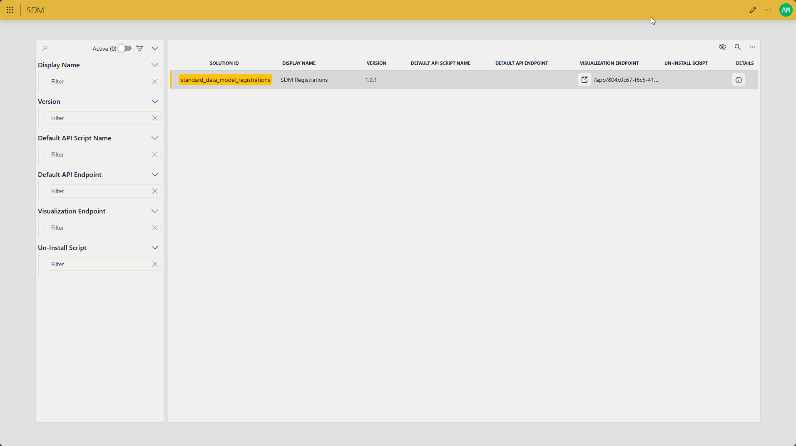

# Solution Registration

## About

When working with multiple DataMiner solutions across different environments, it is important to keep track of the installed solution versions, and the data types included in those solutions.

This solution serves as a central registry for that information. It comes with:

- A C# library for registering your DataMiner solutions and their data types.
- A low-code app for browsing and reviewing all registered solutions and their data types in a particular DataMiner System.

## Use Cases

A centralized registry of all installed DataMiner solutions opens the door to many possibilities, such as:

- **Dependency checks** - Before installing a new solution, check if the required dependencies are in place.
- **Version-aware migrations** - Detect if an older version of your solution is present, and apply the right upgrade or data migration steps.
- **Environment auditing** - Get a complete overview of what is installed on a system, making it easier to spot inconsistencies.
- **Upgrade planning** - Identify outdated solutions that need upgrading, helping you schedule and prioritize updates.
- **Troubleshooting** - Quickly confirm if a reported issue might be linked to a missing or incompatible solution version.

## Technical Reference

For more information on how to leverage the registration library for your solutions, refer to the [documentation in the repository](https://github.com/SkylineCommunications/SLC-SDM-Registration/tree/main/docs).

For additional help, please reach out to [arne.maes@skyline.be](mailto:arne.maes@skyline.be).
